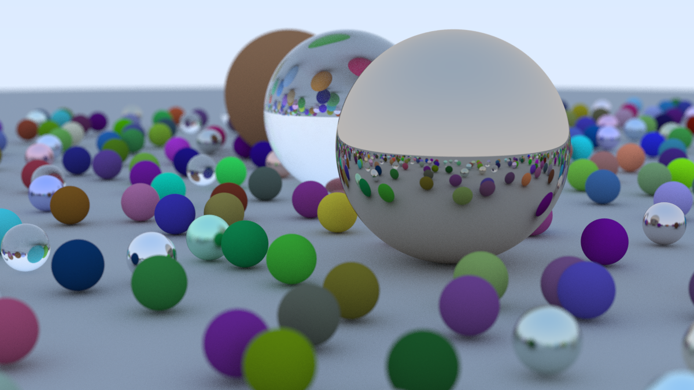

# ray_tracing_in_one_weekend
It is a Rust implementation of ["Ray Tracing In One Weekend" by Peter Shirley](https://raytracing.github.io/books/RayTracingInOneWeekend.html)

have been learning from [fralken's implementation](https://github.com/fralken/ray-tracing-in-one-weekend) & [zhing2006's implementation](https://github.com/zhing2006/Ray-Tracing-in-One-Weekend-CN)

i have finished [the next book](https://github.com/cr-chan/rtnw).

